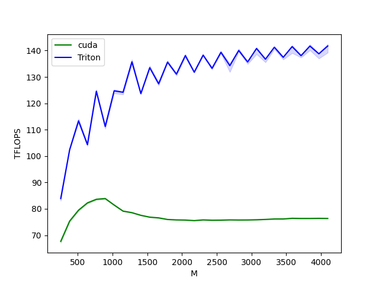

# GPU Kernels
This project implements GPU kernels in Triton for [PagedAttention](https://arxiv.org/abs/2309.06180) and [AWQ](https://arxiv.org/abs/2306.00978).

The PagedAttention kernel is not faster than the existing CUDA kernel because Triton has limitations that prevent it from doing the necessary tensor operations. See
1. https://github.com/openai/triton/issues/2488
2. https://github.com/openai/triton/issues/2522

The AWQ kernel is much faster than the existing CUDA implementation, in addition to being simpler (~ 300 lines of C + inline assembly vs ~ 50 lines of Triton).

Here's a performance graph:

