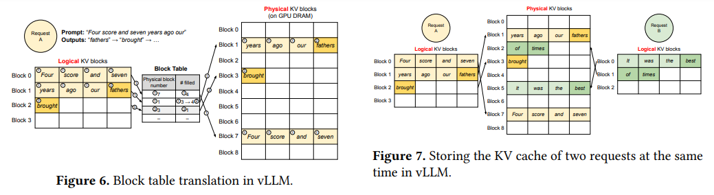
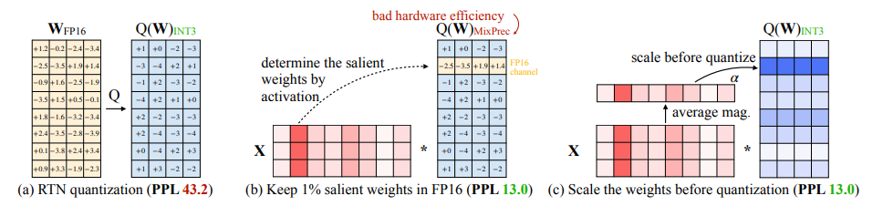

# GPU Kernels
This project implements GPU kernels in CUDA/Triton for Allreduce, [PagedAttention](https://arxiv.org/abs/2309.06180), and [Activation-aware Weight Quantization](https://arxiv.org/abs/2306.00978).

### Allreduce
There's an implementation of a one-pass allreduce (all ranks read/write from other ranks). The implementation is largely a stripped down version of: https://github.com/vllm-project/vllm/pull/2192. In the process of writing the code, I learned a bunch about CUDA/MPI/etc.

### PagedAttention:

Paged attention stores KV vectors in a cache, instead of recomputing them.

The PagedAttention kernel is not faster than the existing CUDA kernel because Triton has limitations that prevent it from doing the necessary tensor operations. See
1. https://github.com/openai/triton/issues/2488
2. https://github.com/openai/triton/issues/2522

### AWQ:

AWQ is a quantization method. This kernel implements fast inference using the quantized weights.

Roughly, the AWQ kernel is dequantizing a matrix using the formula `scale * (weight - zero_point)` before doing a standard FP16 matmul.

The AWQ kernel is much faster than the existing CUDA implementation, in addition to being simpler (~ 300 lines of C + inline assembly vs ~ 50 lines of Triton).

Here's a performance comparison:

Credit to 
- The Triton matmul tutorial
- [GPTQ-Triton](https://github.com/fpgaminer/GPTQ-triton) for discovering a few clever tricks I used in this kernel and making me realize that using Triton for quantization inference was possible